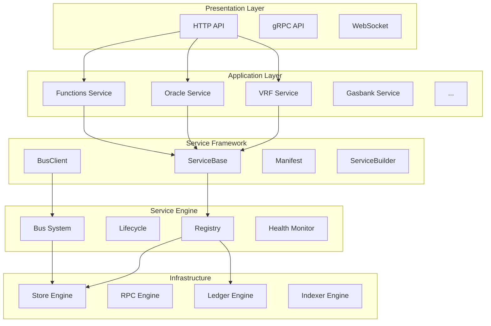

# Service Layer Architecture Design

## Executive Summary

This document presents a comprehensive architecture design for the Service Layer platform, defining the **Service Engine** (Service OS), **Service Framework** (developer tools and APIs), and guidelines for building services.

The architecture follows **SOLID**, **KISS**, **DRY**, and **YAGNI** principles throughout.

---

## 1. Current Architecture Analysis

### 1.1 Existing Components

```
service_layer/
├── internal/
│   ├── engine/              # Service OS Core (~1500 lines)
│   │   ├── engine.go        # Main orchestrator (needs refactoring)
│   │   ├── apis.go          # API Surface definitions
│   │   └── runtime/         # Runtime adapters
│   │       ├── service_modules.go   # Service wrappers
│   │       ├── application.go       # App runtime
│   │       └── infrastructure_modules.go
│   ├── framework/           # Service development base
│   │   ├── base.go          # ServiceBase (readiness)
│   │   ├── bus.go           # BusClient interface
│   │   ├── bus_impl.go      # Bus implementation
│   │   ├── manifest.go      # Service manifest
│   │   └── errors.go        # Framework errors
│   └── services/            # Application services (17+)
│       ├── core/            # Shared service utilities
│       │   ├── base.go      # Account validation
│       │   ├── descriptor.go # Service descriptors
│       │   ├── dispatch.go  # Request dispatch
│       │   └── ...
│       ├── accounts/        # Account service
│       ├── functions/       # Functions service
│       ├── vrf/             # VRF service
│       └── ...
```

### 1.2 Strengths

| Aspect | Description |
|--------|-------------|
| **Modular Design** | Clear separation between Engine, Framework, and Services |
| **Interface-Driven** | Well-defined contracts (ServiceModule, Engine interfaces) |
| **Lifecycle Management** | Proper Start/Stop with dependency ordering |
| **API Surfaces** | Explicit capability advertising |
| **Health Monitoring** | Readiness probes and health tracking |

### 1.3 Areas for Improvement

| Area | Issue | Impact |
|------|-------|--------|
| **Engine Size** | 1500+ lines in single file | Maintainability |
| **Service Registration** | Hardcoded in `wrapServices()` | Extensibility |
| **Service Discovery** | No dynamic discovery | Scalability |
| **Bus System** | Simple fan-out, no routing/filtering | Flexibility |
| **Config Management** | No hot-reload support | Operations |

---

## 2. Layered Architecture Design

### 2.1 Architecture Overview

```
┌─────────────────────────────────────────────────────────────────────────┐
│                           PRESENTATION LAYER                             │
│  ┌─────────────────┐  ┌─────────────────┐  ┌─────────────────────────┐  │
│  │   HTTP API      │  │   gRPC API      │  │   WebSocket API         │  │
│  │   (httpapi/)    │  │   (future)      │  │   (future)              │  │
│  └────────┬────────┘  └────────┬────────┘  └───────────┬─────────────┘  │
├───────────┴────────────────────┴───────────────────────┴────────────────┤
│                           APPLICATION LAYER                              │
│  ┌─────────────────────────────────────────────────────────────────────┐│
│  │ VRF │ Oracle │ Functions │ Gasbank │ Automation │ DataFeeds │ ... ││
│  │                  (internal/services/*)                              ││
│  └──────────────────────────────┬──────────────────────────────────────┘│
├─────────────────────────────────┴───────────────────────────────────────┤
│                         SERVICE FRAMEWORK                                │
│  ┌──────────────┐ ┌──────────────┐ ┌──────────────┐ ┌──────────────┐   │
│  │ ServiceBase  │ │ BusClient    │ │ Manifest     │ │ Lifecycle    │   │
│  │ (readiness)  │ │ (pub/sub)    │ │ (contract)   │ │ (hooks)      │   │
│  └──────────────┘ └──────────────┘ └──────────────┘ └──────────────┘   │
│  ┌──────────────┐ ┌──────────────┐ ┌──────────────┐ ┌──────────────┐   │
│  │ Config       │ │ Observability│ │ Testing      │ │ DevTools     │   │
│  │ (loader)     │ │ (trace/log)  │ │ (mocks)      │ │ (codegen)    │   │
│  └──────────────┘ └──────────────┘ └──────────────┘ └──────────────┘   │
├─────────────────────────────────────────────────────────────────────────┤
│                      SERVICE ENGINE (OS CORE)                            │
│  ┌────────────────────────────────────────────────────────────────┐    │
│  │                         Engine                                  │    │
│  │  ┌──────────┐ ┌──────────┐ ┌──────────┐ ┌──────────┐          │    │
│  │  │ Registry │ │ Lifecycle│ │   Bus    │ │  Health  │          │    │
│  │  └──────────┘ └──────────┘ └──────────┘ └──────────┘          │    │
│  │  ┌──────────┐ ┌──────────┐ ┌──────────┐ ┌──────────┐          │    │
│  │  │ Deps     │ │ API Surf │ │ Perms    │ │ Config   │          │    │
│  │  └──────────┘ └──────────┘ └──────────┘ └──────────┘          │    │
│  └────────────────────────────────────────────────────────────────┘    │
├─────────────────────────────────────────────────────────────────────────┤
│                        INFRASTRUCTURE LAYER                              │
│  ┌─────────┐ ┌─────────┐ ┌─────────┐ ┌─────────┐ ┌─────────────────┐  │
│  │ Store   │ │  RPC    │ │ Ledger  │ │ Indexer │ │ DataSource      │  │
│  │ (pg/mem)│ │ (multi) │ │ (neo)   │ │ (neo)   │ │ (feeds/api)     │  │
│  └─────────┘ └─────────┘ └─────────┘ └─────────┘ └─────────────────┘  │
└─────────────────────────────────────────────────────────────────────────┘
```

### 2.2 Layer Responsibilities

| Layer | Responsibility | Components |
|-------|---------------|------------|
| **Presentation** | External API exposure | HTTP, gRPC, WebSocket handlers |
| **Application** | Business logic | Domain services (VRF, Oracle, etc.) |
| **Framework** | Developer productivity | ServiceBase, BusClient, Testing |
| **Engine** | Service orchestration | Registry, Lifecycle, Bus, Health |
| **Infrastructure** | External systems | Store, RPC, Ledger, Indexer |

---

## 3. Service Engine (OS Core) Design

### 3.1 Module Decomposition

Refactor `engine.go` (~1500 lines) into focused modules:

```
internal/engine/
├── engine.go           # Core coordinator (~200 lines)
├── interfaces.go       # All interface definitions
├── registry.go         # Module registration and lookup
├── lifecycle.go        # Start/Stop management
├── bus.go              # Event/Data/Compute buses
├── health.go           # Health checks and readiness
├── dependency.go       # Dependency resolution
├── apis.go             # API Surface (existing)
├── options.go          # Engine configuration
└── runtime/            # Runtime adapters (existing)
```

### 3.2 Core Interfaces

```go
// internal/engine/interfaces.go

// ServiceModule is the base contract for all services
type ServiceModule interface {
    Name() string
    Domain() string
    Start(ctx context.Context) error
    Stop(ctx context.Context) error
}

// Engine Types (capability-based)
type AccountEngine interface {
    ServiceModule
    CreateAccount(ctx context.Context, owner string, metadata map[string]string) (string, error)
    ListAccounts(ctx context.Context) ([]any, error)
}

type StoreEngine interface {
    ServiceModule
    Ping(ctx context.Context) error
}

type ComputeEngine interface {
    ServiceModule
    Invoke(ctx context.Context, payload any) (any, error)
}

type DataEngine interface {
    ServiceModule
    Push(ctx context.Context, topic string, payload any) error
}

type EventEngine interface {
    ServiceModule
    Publish(ctx context.Context, event string, payload any) error
    Subscribe(ctx context.Context, event string, handler func(context.Context, any) error) error
}

// Infrastructure engines
type LedgerEngine interface { ... }
type IndexerEngine interface { ... }
type RPCEngine interface { ... }
type DataSourceEngine interface { ... }
type ContractsEngine interface { ... }
type ServiceBankEngine interface { ... }
type CryptoEngine interface { ... }
```

### 3.3 Registry Design

```go
// internal/engine/registry.go

type Registry interface {
    Register(module ServiceModule) error
    Unregister(name string) error
    Lookup(name string) ServiceModule
    Modules() []string
    ModulesByDomain(domain string) []ServiceModule

    // Type-safe accessors
    AccountEngines() []AccountEngine
    StoreEngines() []StoreEngine
    ComputeEngines() []ComputeEngine
    DataEngines() []DataEngine
    EventEngines() []EventEngine
}

type registry struct {
    mu       sync.RWMutex
    modules  map[string]ServiceModule
    order    []string
    ordering []string // explicit startup order
}
```

### 3.4 Lifecycle Management

```go
// internal/engine/lifecycle.go

type LifecycleManager interface {
    Start(ctx context.Context) error
    Stop(ctx context.Context) error
    MarkStarted(names ...string)
    MarkStopped(names ...string)
}

type lifecycleManager struct {
    registry   Registry
    dependency DependencyResolver
    health     HealthMonitor
    log        *log.Logger
}

func (lm *lifecycleManager) Start(ctx context.Context) error {
    // 1. Verify dependencies
    if err := lm.dependency.Verify(); err != nil {
        return err
    }

    // 2. Resolve startup order
    order, err := lm.dependency.ResolveOrder()
    if err != nil {
        return err
    }

    // 3. Start modules in order with rollback on failure
    var started []ServiceModule
    for _, name := range order {
        mod := lm.registry.Lookup(name)
        if err := mod.Start(ctx); err != nil {
            lm.stopReverse(ctx, started)
            return fmt.Errorf("start %s: %w", name, err)
        }
        started = append(started, mod)
        lm.health.SetStatus(name, "started")
    }
    return nil
}
```

### 3.5 Bus System Design

```go
// internal/engine/bus.go

type Bus interface {
    // Event bus
    PublishEvent(ctx context.Context, event string, payload any) error
    SubscribeEvent(ctx context.Context, event string, handler EventHandler) error

    // Data bus
    PushData(ctx context.Context, topic string, payload any) error

    // Compute bus
    InvokeCompute(ctx context.Context, payload any) ([]InvokeResult, error)
}

type EventHandler func(context.Context, any) error

type InvokeResult struct {
    Module string
    Result any
    Err    error
}

type bus struct {
    registry Registry
    subs     map[string][]EventHandler
    mu       sync.RWMutex
}

// Fan-out to all EventEngines + local subscribers
func (b *bus) PublishEvent(ctx context.Context, event string, payload any) error {
    engines := b.registry.EventEngines()

    var errs []error
    for _, eng := range engines {
        if err := eng.Publish(ctx, event, payload); err != nil {
            errs = append(errs, fmt.Errorf("%s: %w", eng.Name(), err))
        }
    }

    // Local subscribers
    b.mu.RLock()
    handlers := b.subs[event]
    b.mu.RUnlock()

    for _, h := range handlers {
        if err := h(ctx, payload); err != nil {
            errs = append(errs, err)
        }
    }

    return errors.Join(errs...)
}
```

### 3.6 Health Monitoring

```go
// internal/engine/health.go

type HealthMonitor interface {
    SetStatus(name, status string)
    SetReady(name string, ready bool, errMsg string)
    GetHealth(name string) ModuleHealth
    ModulesHealth() []ModuleHealth
    ProbeReadiness(ctx context.Context)
}

type ModuleHealth struct {
    Name        string     `json:"name"`
    Domain      string     `json:"domain,omitempty"`
    Status      string     `json:"status"` // registered|starting|started|stopped|failed
    ReadyStatus string     `json:"ready_status,omitempty"` // ready|not-ready
    ReadyError  string     `json:"ready_error,omitempty"`
    StartedAt   *time.Time `json:"started_at,omitempty"`
    StoppedAt   *time.Time `json:"stopped_at,omitempty"`
    UpdatedAt   time.Time  `json:"updated_at"`
}
```

---

## 4. Service Framework Design

### 4.1 Enhanced Directory Structure

```
internal/framework/
├── base.go                 # ServiceBase (existing, enhanced)
├── bus.go                  # BusClient interface (existing)
├── bus_impl.go             # Bus implementation (existing)
├── manifest.go             # Service manifest (existing)
├── errors.go               # Framework errors (existing)
├── builder.go              # ServiceBuilder pattern (NEW)
├── lifecycle/              # Lifecycle helpers (NEW)
│   ├── hooks.go            # Pre/Post Start/Stop hooks
│   └── graceful.go         # Graceful shutdown helpers
├── config/                 # Configuration management (NEW)
│   ├── loader.go           # Config loading
│   ├── validator.go        # Config validation
│   └── watcher.go          # Hot-reload support
├── observability/          # Observability (NEW)
│   ├── tracer.go           # Distributed tracing
│   ├── metrics.go          # Metrics collection
│   └── logger.go           # Structured logging
├── testing/                # Testing utilities (NEW)
│   ├── mock_bus.go         # Mock BusClient
│   ├── mock_store.go       # Mock stores
│   └── test_service.go     # Test service base
└── devtools/               # Developer tools (NEW)
    ├── codegen/            # Code generation
    │   └── service.go      # Service scaffold generator
    └── validate/           # Validation tools
        └── manifest.go     # Manifest validator
```

### 4.2 Service Builder Pattern

```go
// internal/framework/builder.go

type ServiceBuilder struct {
    name        string
    domain      string
    manifest    *Manifest
    startHooks  []func(context.Context) error
    stopHooks   []func(context.Context) error
    readyCheck  func(context.Context) error
    bus         BusClient
}

func NewService(name, domain string) *ServiceBuilder {
    return &ServiceBuilder{
        name:   name,
        domain: domain,
        manifest: &Manifest{
            Name:   name,
            Domain: domain,
            Layer:  "service",
        },
    }
}

func (b *ServiceBuilder) WithManifest(m *Manifest) *ServiceBuilder {
    b.manifest = m
    return b
}

func (b *ServiceBuilder) WithCapabilities(caps ...string) *ServiceBuilder {
    b.manifest.Capabilities = append(b.manifest.Capabilities, caps...)
    return b
}

func (b *ServiceBuilder) DependsOn(deps ...string) *ServiceBuilder {
    b.manifest.DependsOn = append(b.manifest.DependsOn, deps...)
    return b
}

func (b *ServiceBuilder) RequiresAPI(apis ...engine.APISurface) *ServiceBuilder {
    b.manifest.RequiresAPIs = append(b.manifest.RequiresAPIs, apis...)
    return b
}

func (b *ServiceBuilder) OnStart(fn func(context.Context) error) *ServiceBuilder {
    b.startHooks = append(b.startHooks, fn)
    return b
}

func (b *ServiceBuilder) OnStop(fn func(context.Context) error) *ServiceBuilder {
    b.stopHooks = append(b.stopHooks, fn)
    return b
}

func (b *ServiceBuilder) WithReadyCheck(fn func(context.Context) error) *ServiceBuilder {
    b.readyCheck = fn
    return b
}

func (b *ServiceBuilder) WithBus(bus BusClient) *ServiceBuilder {
    b.bus = bus
    return b
}

func (b *ServiceBuilder) Build() (engine.ServiceModule, error) {
    if b.name == "" {
        return nil, fmt.Errorf("service name required")
    }
    if b.domain == "" {
        return nil, fmt.Errorf("service domain required")
    }

    b.manifest.Normalize()
    if err := b.manifest.Validate(); err != nil {
        return nil, err
    }

    return &builtService{
        ServiceBase: ServiceBase{name: b.name},
        domain:      b.domain,
        manifest:    b.manifest,
        startHooks:  b.startHooks,
        stopHooks:   b.stopHooks,
        readyCheck:  b.readyCheck,
        bus:         b.bus,
    }, nil
}

type builtService struct {
    ServiceBase
    domain     string
    manifest   *Manifest
    startHooks []func(context.Context) error
    stopHooks  []func(context.Context) error
    readyCheck func(context.Context) error
    bus        BusClient
}

func (s *builtService) Name() string               { return s.name }
func (s *builtService) Domain() string             { return s.domain }
func (s *builtService) Manifest() *Manifest        { return s.manifest }

func (s *builtService) Start(ctx context.Context) error {
    for _, hook := range s.startHooks {
        if err := hook(ctx); err != nil {
            return err
        }
    }
    s.MarkReady(true)
    return nil
}

func (s *builtService) Stop(ctx context.Context) error {
    s.MarkReady(false)
    // Run stop hooks in reverse order
    for i := len(s.stopHooks) - 1; i >= 0; i-- {
        if err := s.stopHooks[i](ctx); err != nil {
            return err
        }
    }
    return nil
}

func (s *builtService) Ready(ctx context.Context) error {
    if s.readyCheck != nil {
        return s.readyCheck(ctx)
    }
    return s.ServiceBase.Ready(ctx)
}
```

### 4.3 Lifecycle Hooks

```go
// internal/framework/lifecycle/hooks.go

type LifecycleHooks struct {
    PreStart  []HookFunc
    PostStart []HookFunc
    PreStop   []HookFunc
    PostStop  []HookFunc
}

type HookFunc func(ctx context.Context) error

func (h *LifecycleHooks) RunPreStart(ctx context.Context) error {
    return runHooks(ctx, h.PreStart)
}

func (h *LifecycleHooks) RunPostStart(ctx context.Context) error {
    return runHooks(ctx, h.PostStart)
}

func (h *LifecycleHooks) RunPreStop(ctx context.Context) error {
    return runHooks(ctx, h.PreStop)
}

func (h *LifecycleHooks) RunPostStop(ctx context.Context) error {
    return runHooks(ctx, h.PostStop)
}

func runHooks(ctx context.Context, hooks []HookFunc) error {
    for _, hook := range hooks {
        if err := hook(ctx); err != nil {
            return err
        }
    }
    return nil
}
```

### 4.4 Testing Utilities

```go
// internal/framework/testing/mock_bus.go

type MockBusClient struct {
    PublishedEvents []PublishedEvent
    PushedData      []PushedData
    InvokeResults   []ComputeResult
    InvokeError     error
    mu              sync.Mutex
}

type PublishedEvent struct {
    Event   string
    Payload any
}

type PushedData struct {
    Topic   string
    Payload any
}

func NewMockBusClient() *MockBusClient {
    return &MockBusClient{}
}

func (m *MockBusClient) PublishEvent(ctx context.Context, event string, payload any) error {
    m.mu.Lock()
    defer m.mu.Unlock()
    m.PublishedEvents = append(m.PublishedEvents, PublishedEvent{Event: event, Payload: payload})
    return nil
}

func (m *MockBusClient) PushData(ctx context.Context, topic string, payload any) error {
    m.mu.Lock()
    defer m.mu.Unlock()
    m.PushedData = append(m.PushedData, PushedData{Topic: topic, Payload: payload})
    return nil
}

func (m *MockBusClient) InvokeCompute(ctx context.Context, payload any) ([]ComputeResult, error) {
    return m.InvokeResults, m.InvokeError
}

// Assertions
func (m *MockBusClient) AssertEventPublished(t *testing.T, event string) {
    m.mu.Lock()
    defer m.mu.Unlock()
    for _, e := range m.PublishedEvents {
        if e.Event == event {
            return
        }
    }
    t.Errorf("expected event %q to be published", event)
}
```

---

## 5. Service Development Guide

### 5.1 Standard Service Structure

```
internal/services/{service-name}/
├── service.go          # Main service implementation
├── service_test.go     # Service tests
├── handlers.go         # HTTP/RPC handlers (optional)
├── store.go            # Storage interface (optional)
├── events.go           # Event definitions (optional)
└── README.md           # Service documentation (optional)
```

### 5.2 Service Implementation Pattern

```go
// internal/services/example/service.go
package example

import (
    "context"

    "github.com/R3E-Network/service_layer/internal/engine"
    "github.com/R3E-Network/service_layer/internal/framework"
)

// Service implements the Example domain service
type Service struct {
    framework.ServiceBase

    manifest *framework.Manifest
    bus      framework.BusClient
    store    Store  // domain-specific store interface
}

// NewService creates a new Example service
func NewService(store Store, bus framework.BusClient) *Service {
    s := &Service{
        manifest: &framework.Manifest{
            Name:         "example",
            Domain:       "example",
            Description:  "Example service demonstrating patterns",
            Layer:        "service",
            Capabilities: []string{"example.read", "example.write"},
            DependsOn:    []string{"svc-accounts"},
            RequiresAPIs: []engine.APISurface{engine.APISurfaceStore},
        },
        store: store,
        bus:   bus,
    }
    s.SetName("example")
    return s
}

// Engine interface implementations
func (s *Service) Name() string                   { return s.manifest.Name }
func (s *Service) Domain() string                 { return s.manifest.Domain }
func (s *Service) Manifest() *framework.Manifest  { return s.manifest }

func (s *Service) Start(ctx context.Context) error {
    // Initialize resources
    s.MarkReady(true)
    return nil
}

func (s *Service) Stop(ctx context.Context) error {
    s.MarkReady(false)
    // Cleanup resources
    return nil
}

// Domain methods
func (s *Service) DoSomething(ctx context.Context, input Input) (*Output, error) {
    if err := s.Ready(ctx); err != nil {
        return nil, err
    }

    // Business logic...
    result, err := s.store.Get(ctx, input.ID)
    if err != nil {
        return nil, err
    }

    // Publish event
    if s.bus != nil {
        _ = s.bus.PublishEvent(ctx, "example.completed", result)
    }

    return result, nil
}
```

### 5.3 Using the Service Builder

```go
// Alternative: using ServiceBuilder for simpler services
func NewSimpleService(store Store) (engine.ServiceModule, error) {
    return framework.NewService("simple", "example").
        WithCapabilities("simple.read").
        DependsOn("svc-accounts").
        RequiresAPI(engine.APISurfaceStore).
        OnStart(func(ctx context.Context) error {
            // Initialize
            return nil
        }).
        OnStop(func(ctx context.Context) error {
            // Cleanup
            return nil
        }).
        Build()
}
```

---

## 6. Implementation Roadmap

### Phase 1: Engine Refactoring (Low Risk)
**Duration**: 1-2 weeks

| Task | Priority | Files Affected |
|------|----------|----------------|
| Extract interfaces to `interfaces.go` | High | New file |
| Extract registry to `registry.go` | High | New file |
| Extract lifecycle to `lifecycle.go` | High | New file |
| Extract bus to `bus.go` | Medium | New file |
| Extract health to `health.go` | Medium | New file |
| Extract options to `options.go` | Low | New file |
| Slim down `engine.go` | High | Existing file |

**Verification**:
- All existing tests pass
- No public API changes
- Module registration unchanged

### Phase 2: Framework Enhancement (Medium Risk)
**Duration**: 2-3 weeks

| Task | Priority | Files Affected |
|------|----------|----------------|
| Add `ServiceBuilder` | High | `builder.go` |
| Add lifecycle hooks | Medium | `lifecycle/hooks.go` |
| Add testing utilities | High | `testing/*.go` |
| Add config loader | Medium | `config/loader.go` |
| Add observability helpers | Low | `observability/*.go` |

**Verification**:
- Example service using builder
- Mock tests demonstrating testing utilities
- Documentation updated

### Phase 3: Service Standardization (High Impact)
**Duration**: 3-4 weeks

| Task | Priority | Services |
|------|----------|----------|
| Create service template | High | Template |
| Migrate accounts service | High | accounts |
| Migrate functions service | High | functions |
| Migrate remaining services | Medium | All others |

**Verification**:
- All services follow standard structure
- Consistent error handling
- Unified logging/tracing

### Phase 4: Advanced Features (Long Term)
**Duration**: 4-6 weeks

| Task | Priority | Notes |
|------|----------|-------|
| Service discovery | Medium | Registry-based |
| Config hot-reload | Low | Watch file changes |
| Enhanced bus routing | Medium | Topic filtering |
| Service metrics | Medium | Prometheus export |

---

## 7. Design Principles Validation

### 7.1 SOLID Compliance

| Principle | Application |
|-----------|-------------|
| **S**ingle Responsibility | Each engine module has one job (registry, lifecycle, bus, health) |
| **O**pen/Closed | New services via interface implementation, not engine modification |
| **L**iskov Substitution | All ServiceModules interchangeable in Engine |
| **I**nterface Segregation | Capability interfaces (AccountEngine, ComputeEngine) are focused |
| **D**ependency Inversion | Services depend on abstractions (BusClient, Store interfaces) |

### 7.2 KISS Compliance

| Area | Simplicity Measure |
|------|-------------------|
| Service creation | Builder pattern with sensible defaults |
| Lifecycle | Simple Start/Stop with automatic dependency ordering |
| Bus | Fan-out to registered engines, no complex routing |
| Health | Simple ready/not-ready state |

### 7.3 DRY Compliance

| Shared Logic | Location |
|--------------|----------|
| Readiness tracking | `framework.ServiceBase` |
| Account validation | `services/core/base.go` |
| Request tracing | `services/core/tracer.go` |
| Service descriptor | `services/core/descriptor.go` |

### 7.4 YAGNI Compliance

| Feature | Status | Rationale |
|---------|--------|-----------|
| Service discovery | Deferred | Current static registration sufficient |
| gRPC API | Deferred | HTTP API meets current needs |
| Message queuing | Deferred | In-memory bus sufficient for now |
| Config hot-reload | Deferred | Restart acceptable for config changes |

---

## 8. Appendix

### A. API Surface Reference

| Surface | Description | Engines |
|---------|-------------|---------|
| `lifecycle` | Start/Stop management | All |
| `readiness` | Health probes | ReadyChecker |
| `account` | Account CRUD | AccountEngine |
| `store` | Persistence | StoreEngine |
| `compute` | Function execution | ComputeEngine |
| `data` | Data push | DataEngine |
| `event` | Pub/sub | EventEngine |
| `rpc` | Chain RPC | RPCEngine |
| `ledger` | Blockchain | LedgerEngine |
| `indexer` | Chain indexing | IndexerEngine |

### B. Service Layer Mapping

| Service | Domain | Layer | Key Capabilities |
|---------|--------|-------|------------------|
| accounts | accounts | service | account.create, account.list |
| functions | functions | service | function.execute, function.manage |
| vrf | vrf | service | vrf.request, vrf.verify |
| oracle | oracle | service | oracle.request, oracle.fulfill |
| gasbank | gasbank | service | gas.deposit, gas.withdraw |
| automation | automation | service | automation.schedule |
| pricefeed | pricefeed | service | price.get, price.subscribe |
| datafeeds | datafeeds | service | feed.subscribe |
| datastreams | datastreams | service | stream.publish |
| datalink | datalink | service | link.request |
| secrets | secrets | service | secret.encrypt, secret.decrypt |
| cre | cre | service | cre.execute |
| ccip | ccip | service | ccip.send |

### C. Mermaid Architecture Diagram



---

*Document Version: 1.0*
*Last Updated: 2025-11-25*
*Author: System Architect*
